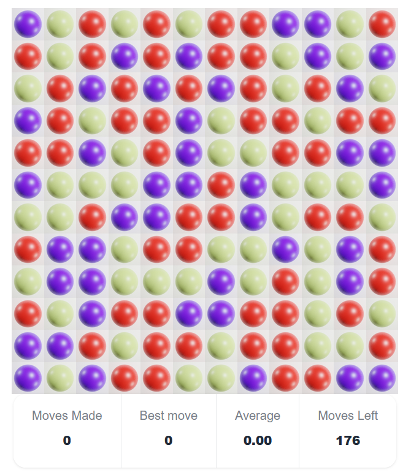

# Red White Blue Game

# Rules

The aim of the game is to capture balls on a grid, as skillfully as possible

The 12 x 12 board starts off filled with balls at random, in one of three colors - red white and blue



Click on a ball to change its colour.

The colours go red > white > blue > red ...

When you change the ball's colour, you capture it, and all the neighbouring balls (4-way) that have the ball's new colour.

- Clicking on red will capture neighbouring white balls
- Clicking on white captures neighbouring blue balls
- Clicking on blue captures neighbouring red balls

The game ends when there are no more valid moves.

Your score is a combination of your best move, and average move scores

```
score = (best capture in one move) * (average captures per move)
```

There are 3 high scores (stored in LocalStorage), for the best move, best average score, and the overall game score.

This screenshot shows a quite successful score


# Strategy

- It's partly down to luck. Some boards are just bad :-)
- Best move score is the biggest part of the final score
- Early moves are key. The higher your first move, the better.
- Try to avoid creating isolated pairs of adjacent colours, as this will bring your average down.
- Islands of a single colour are good, because they are 'out of the game'.
- It's perfectly ok to make a move that captures nothing.
- It's not just about capturing as many as possible; bringing the number of remaining moves down quickly also helps.
